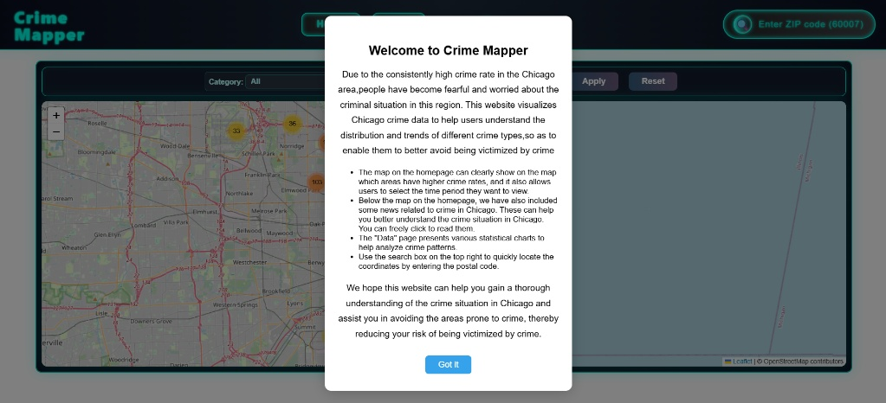
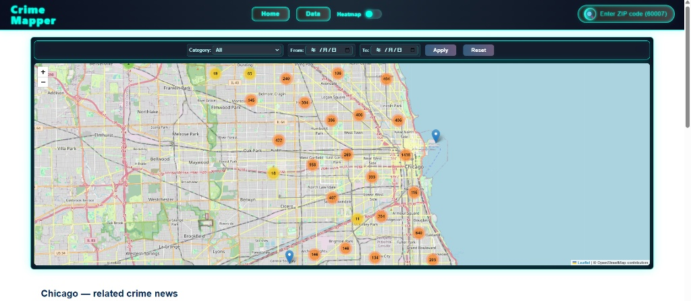
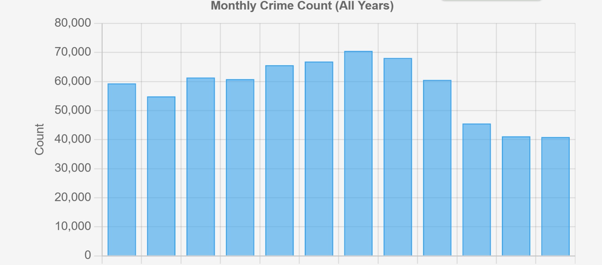

# 🏙️ Chicago Crime Data Visualization Platform

> This project designs and implements a Web platform to visually display recent Chicago crime statistics, including crime type, time trends, and spatial distribution, using an interactive map and statistical charts. The goal is to enhance public awareness of urban safety and risk.

## 🔗 Project Links

- **GitHub Repository:** `https://github.com/CrazyEpi/casa0017-web-assessment-Crazy-Thursday-Vivo-50`  
- **Website Demo (Internal IP):** `10.129.111.11:3000`

---

## 🖼️ Screenshots Overview

**Introductory modal on first load**

**Home page: clustered crime map**

**Home page: Chicago crime news list**

**Data page: overview of charts**

**Example chart: monthly crime count**

---

## ✨ Key Features

The platform consists of two main sections: **Home** (Map) and **Data** (Statistics).

### 📍 Home Page – Interactive Crime Map

The Home page features a dynamic map centered on Chicago (`[41.8781, -87.6298]`) for spatial crime visualization.

- **Map Visualization Modes**
  - **Marker Cluster View:** Uses `leaflet.markercluster` to group nearby crime incidents into clusters, providing an uncluttered overview of density at different zoom levels.
  - **Heatmap View:** Utilizes `leaflet.heat` to show a continuous intensity surface, clearly highlighting crime hot spots across the city.

- **Data Filtering and Control**
  - **Real-time Filtering:** Users can filter the displayed crime data on the map by **Crime Type (Category)** and **Date Range (From / To dates)**.
  - The map automatically updates when the user pans or zooms, so only incidents in the current map extent are requested from the server.

- **ZIP Code Search**
  - A search box in the navigation bar allows users to input a ZIP code to automatically pan the map to the location and place a marker.

- **Crime News Section**
  - A list of selected Chicago crime-related news articles is displayed below the map (currently static content).

### 📊 Data Page – Statistical Analysis

The Data page provides analytical charts using Chart.js to help users understand crime patterns.

- **Time Trend Analysis**
  - Visualizes crime counts by **Month** and **Day of the Week** to identify temporal patterns.

- **Crime Type Distribution**
  - Displays the **Top 10** most frequent crime types, aggregating the rest into an “Other” category for clarity.

- **Binary Outcome Analysis**
  - Presents the proportion of crimes resulting in **Arrest** (typically low, under 15%) and the distribution of **Domestic Incidents** (approximately 15–20% of total crimes).

- **Location and Description Analysis**
  - Shows top crime descriptions and key location descriptions to highlight common scenarios and settings.

---

## ⚙️ Technology Stack

| Area           | Technology/Tool                | Description                                                     |
| :------------ | :----------------------------- | :-------------------------------------------------------------- |
| **Frontend**  | HTML, CSS, JavaScript          | Structure, style, and client-side logic.                        |
| **Mapping**   | Leaflet.js, OpenStreetMap      | Core interactive map library and base map tiles.                |
| **Plugins**   | `leaflet.markercluster`, `leaflet.heat` | Point aggregation and hot spot visualisation.           |
| **Charting**  | Chart.js                       | Statistical bar and pie charts on the Data page.                |
| **Backend**   | Node.js (Express)              | Lightweight server for handling API requests and static files.  |
| **Database**  | SQLite3 (`better-sqlite3`)     | Stores over 170,000 crime records (e.g. 2025 data).             |
| **Deployment**| Raspberry Pi                   | Website hosted and run on a Raspberry Pi device.                |

---

## 👥 Group Members

This project was completed as the Final Report for the CASA0017 Web Architecture course.

- Wu Yitong (25041013)  
- Hu Haoyu (25037784)  
- He Jiahua (25086119)  
- Wang Ziyi (25044289)
